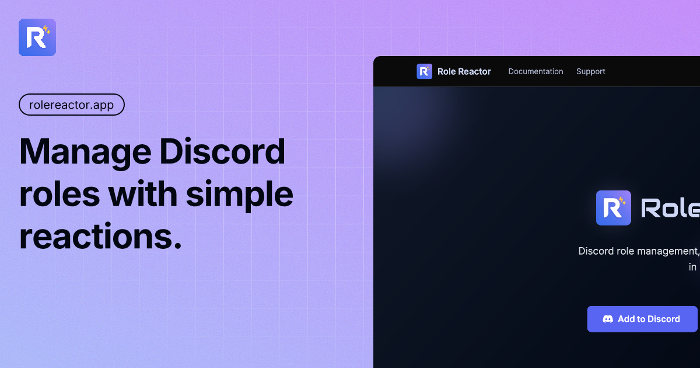

<div align="center">


# Role Reactor Documentation

**Official documentation website for the Role Reactor Discord bot**  
_Streamline your Discord server role management with powerful reaction-based role assignment_

[](https://rolereactor.app)
[](https://rolereactor.app/docs)
[](LICENSE)
[](https://nextjs.org)
[](https://typescriptlang.org)

[](https://rolereactor.app)

</div>

---

## 🚀 Features

<div align="center">

| Feature                            | Description                                                  |
| ---------------------------------- | ------------------------------------------------------------ |
| 📚 **Comprehensive Documentation** | Complete guides for bot setup, commands, and troubleshooting |
| 🔍 **Smart Search**                | Fast content search across all documentation pages           |
| 📱 **Responsive Design**           | Optimized for desktop, tablet, and mobile devices            |
| ⚡ **Performance Optimized**       | Built with Next.js 15 for blazing fast loading               |
| 🎨 **Modern UI**                   | Clean, accessible design with Tailwind CSS                   |
| 🔧 **Developer Friendly**          | TypeScript, ESLint, and comprehensive testing                |

</div>

## 🛠️ Tech Stack

<div align="center">


</div>

### Core Technologies

- **Framework**: [Next.js 15](https://nextjs.org/) with App Router
- **Documentation**: [Fumadocs](https://fumadocs.vercel.app/) with MDX support
- **Styling**: [Tailwind CSS 4.1](https://tailwindcss.com/)
- **Language**: [TypeScript 5.8](https://typescriptlang.org/)
- **Testing**: [Jest](https://jestjs.io/) with React Testing Library
- **Package Manager**: [pnpm](https://pnpm.io/)

## 📦 Quick Start

### Prerequisites

- Node.js 18+
- pnpm (recommended) or npm

### Installation

```bash
# Clone the repository
git clone https://github.com/tyecode-bots/role-reactor-website.git
cd role-reactor-website

# Install dependencies
pnpm install

# Start development server
pnpm dev
```

Visit [http://localhost:3000](http://localhost:3000) to view the documentation.

## 📁 Project Structure

```
role-reactor-website/
├── 📄 content/docs/           # Documentation content (MDX)
│   ├── 📖 commands/          # Bot command documentation
│   ├── 🎯 examples/          # Real-world use cases
│   ├── 🚀 getting-started/   # Setup and installation guides
│   ├── 🔧 troubleshooting/   # FAQ and common issues
│   └── 📝 changelog/         # Version history
├── 🎨 src/
│   ├── 📱 app/              # Next.js App Router pages
│   ├── 🧩 components/       # Reusable React components
│   ├── 📊 constants/        # Application constants
│   └── 🛠️ lib/             # Utility functions
└── 🖼️ public/              # Static assets (logos, icons)
```

## 🚀 Available Scripts

<div align="center">

| Command              | Description                              |
| -------------------- | ---------------------------------------- |
| `pnpm dev`           | Start development server with hot reload |
| `pnpm build`         | Build for production                     |
| `pnpm start`         | Start production server                  |
| `pnpm lint`          | Run ESLint for code quality              |
| `pnpm type-check`    | Run TypeScript type checking             |
| `pnpm test`          | Run Jest tests                           |
| `pnpm test:watch`    | Run tests in watch mode                  |
| `pnpm test:coverage` | Generate test coverage report            |

</div>

## 📚 Documentation Sections

### 🚀 Getting Started

- **Introduction**: Overview of Role Reactor bot capabilities
- **Setup**: Step-by-step installation and configuration
- **Adding Bot**: How to add the bot to your Discord server
- **First Steps**: Initial setup and basic configuration

### 🎮 Commands

- **General Commands**: Help, invite, support commands
- **Role Management**: Setup, list, update, delete reaction roles
- **Temporary Roles**: Assign and manage temporary roles

### 🎯 Examples

- **Community Server**: Managing community roles and permissions
- **Educational Server**: Academic role management and organization
- **Gaming Server**: Gaming community setup and role hierarchy

### 🔧 Troubleshooting

- **Common Issues**: Frequently encountered problems and solutions
- **FAQ**: Frequently asked questions and answers
- **Support**: Getting help and community support

## 🔧 Development Guidelines

### Commit Convention

This project enforces [Conventional Commits](https://www.conventionalcommits.org/) using Husky and Commitlint.

#### Commit Message Format

```
<type>[optional scope]: <description>

[optional body]

[optional footer(s)]
```

#### Allowed Types

| Type       | Description                                         |
| ---------- | --------------------------------------------------- |
| `feat`     | A new feature                                       |
| `fix`      | A bug fix                                           |
| `docs`     | Documentation only changes                          |
| `style`    | Changes that do not affect code meaning             |
| `refactor` | Code change that neither fixes bug nor adds feature |
| `perf`     | Code change that improves performance               |
| `test`     | Adding missing tests or correcting existing tests   |
| `build`    | Changes that affect build system or dependencies    |
| `ci`       | Changes to CI configuration files and scripts       |
| `chore`    | Other changes that don't modify src or test files   |
| `revert`   | Reverts a previous commit                           |

#### Examples

```bash
feat: add privacy policy page
fix: resolve mobile navigation bug
docs: update installation instructions
style: improve button hover animations
refactor: extract common utility functions
```

### Pre-commit Hooks

- ✅ ESLint checks for code quality
- ✅ TypeScript type checking
- ✅ Commit message validation

## 🌐 Deployment

### Vercel (Recommended)

1. Connect your GitHub repository to [Vercel](https://vercel.com)
2. Vercel automatically detects Next.js and builds the project
3. Deploy with zero configuration

### Environment Variables

```env
NEXT_PUBLIC_SITE_URL=https://rolereactor.app
```

## 🤝 Contributing

We welcome contributions! Please follow these steps:

1. **Fork** the repository
2. **Create** a feature branch: `git checkout -b feature/amazing-feature`
3. **Make** your changes following the commit convention
4. **Test** your changes: `pnpm test`
5. **Push** to the branch: `git push origin feature/amazing-feature`
6. **Open** a Pull Request

### Development Setup

```bash
# Install dependencies
pnpm install

# Run tests
pnpm test

# Run linting
pnpm lint

# Type checking
pnpm type-check
```

## 📖 Learn More

- [📚 Next.js Documentation](https://nextjs.org/docs) - Learn about Next.js features and API
- [📖 Fumadocs](https://fumadocs.vercel.app) - Learn about the Fumadocs documentation framework
- [🤖 Role Reactor Bot](https://github.com/tyecode-bots/role-reactor-bot) - The Discord bot this website documents
- [🎨 Tailwind CSS](https://tailwindcss.com/docs) - Utility-first CSS framework

## 📄 License

This project is licensed under the MIT License - see the [LICENSE](LICENSE) file for details.

---

<div align="center">

**Made with ❤️ by [tyecode](https://github.com/tyecode)**

[](https://rolereactor.app)
[](https://rolereactor.app/docs)
[](https://github.com/tyecode-bots/role-reactor-website)

</div>
