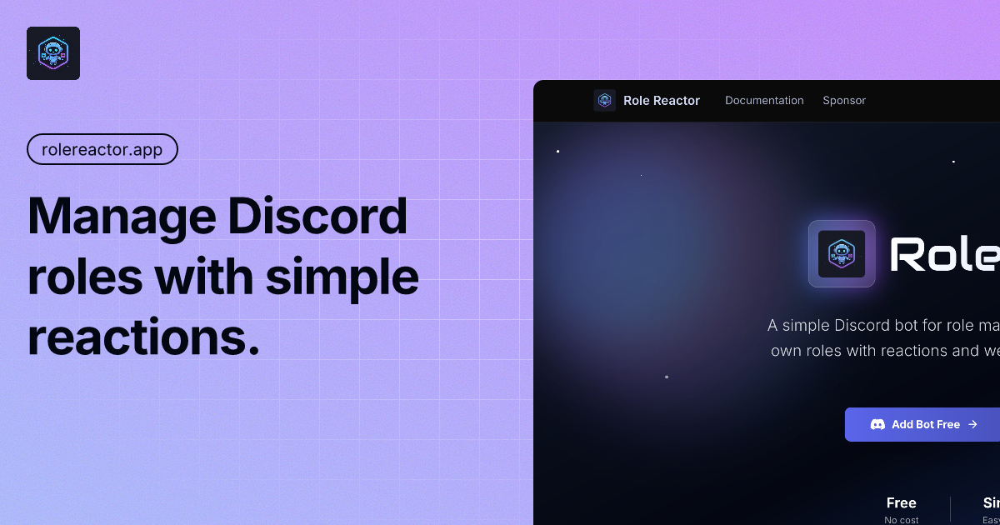

<div align="center">


# Role Reactor Documentation

**Official Documentation Website**

_Comprehensive documentation platform for the Role Reactor Discord bot_

[](https://rolereactor.app)
[](https://rolereactor.app/docs)
[](LICENSE)
[](https://nextjs.org)
[](https://typescriptlang.org)

[](https://rolereactor.app)

---

</div>

## 📋 Table of Contents

- [Overview](#-overview)
- [Features](#-features)
- [Technology Stack](#-technology-stack)
- [Getting Started](#-getting-started)
- [Project Structure](#-project-structure)
- [Development](#-development)
- [Documentation](#-documentation)
- [Deployment](#-deployment)
- [Contributing](#-contributing)
- [License](#-license)

## 🎯 Overview

**Role Reactor Documentation** is the official documentation website for the Role Reactor Discord bot. Built with modern web technologies, this platform provides comprehensive guides, command references, examples, and troubleshooting resources to help users effectively utilize the Role Reactor bot in their Discord servers.

### Key Highlights

- **Comprehensive Documentation**: Complete guides covering bot setup, configuration, commands, and advanced features
- **Modern Architecture**: Built with Next.js 15 and React 19 for optimal performance and user experience
- **Developer-Friendly**: TypeScript, comprehensive testing, and strict code quality standards
- **Responsive Design**: Optimized for all devices with a clean, accessible interface
- **Fast & Reliable**: Performance-optimized with Next.js App Router and modern build tools

## ✨ Features

<div align="center">

| Feature                            | Description                                                                     |
| ---------------------------------- | ------------------------------------------------------------------------------- |
| 📚 **Comprehensive Documentation** | Complete guides for bot setup, commands, troubleshooting, and advanced features |
| 🔍 **Intelligent Search**          | Fast, accurate content search across all documentation pages                    |
| 📱 **Fully Responsive**            | Seamless experience across desktop, tablet, and mobile devices                  |
| ⚡ **Performance Optimized**       | Built with Next.js 15 for blazing-fast page loads and optimal performance       |
| 🎨 **Modern UI/UX**                | Clean, accessible design with Tailwind CSS and smooth animations                |
| 🔧 **Developer Experience**        | TypeScript, ESLint, comprehensive testing, and automated quality checks         |
| 📖 **MDX Support**                 | Rich content authoring with Markdown and React components                       |
| 🌐 **SEO Optimized**               | Built-in SEO features with OpenGraph and structured data                        |

</div>

## 🛠️ Technology Stack

### Core Technologies

<div align="center">


</div>

### Technology Breakdown

| Category            | Technology                                    | Version | Purpose                                    |
| ------------------- | --------------------------------------------- | ------- | ------------------------------------------ |
| **Framework**       | [Next.js](https://nextjs.org/)                | 15.4.3  | React framework with App Router            |
| **UI Library**      | [React](https://react.dev/)                   | 19.1.0  | User interface components                  |
| **Language**        | [TypeScript](https://www.typescriptlang.org/) | 5.8     | Type-safe JavaScript                       |
| **Styling**         | [Tailwind CSS](https://tailwindcss.com/)      | 4.1     | Utility-first CSS framework                |
| **Documentation**   | [Fumadocs](https://fumadocs.vercel.app/)      | 15.6.5  | Documentation framework with MDX           |
| **Testing**         | [Jest](https://jestjs.io/)                    | 29.7    | Testing framework                          |
| **Package Manager** | [pnpm](https://pnpm.io/)                      | Latest  | Fast, disk space efficient package manager |

### Additional Tools & Libraries

| Category          | Tools                                               |
| ----------------- | --------------------------------------------------- |
| **UI Components** | Radix UI primitives, Lucide React icons             |
| **Code Quality**  | ESLint, TypeScript compiler, Husky pre-commit hooks |
| **Documentation** | MDX support for rich content authoring              |
| **Build Tools**   | Next.js Turbo mode for faster development           |

## 🚀 Getting Started

### Prerequisites

Before you begin, ensure you have the following installed on your system:

- **Node.js**: Version 18.0.0 or higher
- **Package Manager**: pnpm (recommended) or npm
- **Git**: For version control

### Installation

1. **Clone the repository**

   ```bash
   git clone https://github.com/qodinger/role-reactor-website.git
   cd role-reactor-website
   ```

2. **Install dependencies**

   ```bash
   pnpm install
   ```

3. **Start the development server**

   ```bash
   pnpm dev
   ```

4. **Open your browser**

   Navigate to [http://localhost:3000](http://localhost:3000) to view the documentation website.

### Quick Start Commands

```bash
# Development
pnpm dev              # Start development server with hot reload

# Production
pnpm build            # Build for production
pnpm start            # Start production server

# Code Quality
pnpm lint             # Run ESLint
pnpm lint:fix         # Fix ESLint errors automatically
pnpm type-check       # Run TypeScript type checking

# Testing
pnpm test             # Run Jest tests
pnpm test:watch       # Run tests in watch mode
pnpm test:coverage    # Generate test coverage report
```

## 📁 Project Structure

```
role-reactor-website/
├── 📄 content/
│   └── docs/                    # Documentation content (MDX files)
│       ├── 📖 commands/        # Bot command documentation
│       │   ├── admin/          # Administrative commands
│       │   └── general/        # General user commands
│       ├── 🎯 examples/        # Real-world use case examples
│       ├── 🚀 getting-started/  # Setup and installation guides
│       ├── 🔧 troubleshooting/ # FAQ and common issues
│       └── 📝 changelog/        # Version history and updates
│
├── 🎨 src/
│   ├── 📱 app/                  # Next.js App Router pages
│   │   ├── (home)/             # Homepage route group
│   │   ├── docs/                # Documentation pages
│   │   ├── api/                 # API routes (search only)
│   │   └── layout.tsx           # Root layout
│   ├── 🧩 components/          # Reusable React components
│   │   ├── common/             # Common UI components
│   │   ├── layout/             # Layout components
│   │   ├── sponsor/             # Sponsor/donation components
│   │   └── ui/                 # UI primitives
│   ├── 📊 constants/           # Application constants
│   └── 🛠️ lib/                # Utility functions and mock data
│
├── 🖼️ public/                   # Static assets
│   ├── images/                 # Images and icons
│   └── *.png                   # Logo and OpenGraph images
│
├── 📝 Configuration Files
│   ├── package.json            # Project dependencies and scripts
│   ├── tsconfig.json           # TypeScript configuration
│   ├── next.config.mjs         # Next.js configuration
│   ├── tailwind.config.js     # Tailwind CSS configuration
│   └── commitlint.config.js    # Commit message linting
│
└── 📚 Documentation
    └── README.md               # This file
```

## 💻 Development

### Development Workflow

1. **Create a feature branch**

   ```bash
   git checkout -b feature/your-feature-name
   ```

2. **Make your changes**

   - Write code following TypeScript best practices
   - Add appropriate tests for new features
   - Update documentation as needed

3. **Run quality checks**

   ```bash
   pnpm lint          # Check code quality
   pnpm type-check    # Verify TypeScript types
   pnpm test          # Run tests
   ```

4. **Commit your changes**

   Follow the [Conventional Commits](#commit-convention) specification.

5. **Push and create a Pull Request**

   ```bash
   git push origin feature/your-feature-name
   ```

### Commit Convention

This project follows the [Conventional Commits](https://www.conventionalcommits.org/) specification. All commit messages must follow this format:

```
<type>[optional scope]: <description>

[optional body]

[optional footer(s)]
```

#### Commit Types

| Type       | Description                           | Example                              |
| ---------- | ------------------------------------- | ------------------------------------ |
| `feat`     | A new feature                         | `feat: add search functionality`     |
| `fix`      | A bug fix                             | `fix: resolve navigation issue`      |
| `docs`     | Documentation changes                 | `docs: update installation guide`    |
| `style`    | Code style changes (formatting, etc.) | `style: format code with prettier`   |
| `refactor` | Code refactoring                      | `refactor: extract common utilities` |
| `perf`     | Performance improvements              | `perf: optimize image loading`       |
| `test`     | Adding or updating tests              | `test: add unit tests for utils`     |
| `build`    | Build system changes                  | `build: update Next.js version`      |
| `ci`       | CI/CD configuration changes           | `ci: add GitHub Actions workflow`    |
| `chore`    | Other changes (dependencies, etc.)    | `chore: update dependencies`         |
| `revert`   | Revert a previous commit              | `revert: revert feature X`           |

#### Commit Examples

```bash
feat: add dark mode support
fix: resolve mobile navigation bug
docs: update getting started guide
style: improve button hover animations
refactor: extract authentication logic
perf: optimize bundle size
test: add component tests
chore: update dependencies
```

### Pre-commit Hooks

This project uses [Husky](https://typicode.github.io/husky/) to run automated checks before commits:

- ✅ **ESLint**: Code quality and style checks
- ✅ **TypeScript**: Type checking and validation
- ✅ **Commitlint**: Commit message format validation

These checks ensure code quality and consistency across the project.

## 📚 Documentation

### Documentation Sections

#### 🚀 Getting Started

- **Introduction**: Overview of Role Reactor bot capabilities and features
- **Setup**: Step-by-step installation and configuration guide
- **Adding Bot**: Instructions for adding the bot to your Discord server
- **First Steps**: Initial setup and basic configuration walkthrough

#### 🎮 Commands

- **General Commands**: User-facing commands (help, invite, support, etc.)
- **Admin Commands**: Administrative commands for server management
  - Role Reactions: Setup and manage reaction-based role assignment
  - Temporary Roles: Create and manage time-limited roles
  - Welcome System: Configure member welcome messages
  - XP Settings: Configure experience points and leveling
  - Schedule Roles: Automate role assignment on schedules
  - Goodbye Messages: Configure member departure messages

#### 🎯 Examples

- **Community Server**: Managing community roles and permissions
- **Educational Server**: Academic role management and organization
- **Gaming Server**: Gaming community setup and role hierarchy

#### 🔧 Troubleshooting

- **Common Issues**: Frequently encountered problems and their solutions
- **FAQ**: Frequently asked questions and comprehensive answers
- **Support**: Getting help and accessing community support

### Adding New Documentation

1. Create a new MDX file in the appropriate `content/docs/` directory
2. Add frontmatter with metadata (title, description, etc.)
3. Write content using Markdown and React components
4. Update navigation in `meta.json` files
5. Test locally with `pnpm dev`

## 🌐 Deployment

### Vercel (Recommended)

[Vercel](https://vercel.com) provides seamless deployment for Next.js applications:

1. **Connect Repository**

   - Sign in to Vercel
   - Import your GitHub repository
   - Vercel will auto-detect Next.js

2. **Configure Environment Variables**

   - Add required environment variables in Vercel dashboard
   - Variables are automatically injected during build

3. **Deploy**
   - Vercel automatically builds and deploys on every push
   - Preview deployments are created for pull requests

### Environment Variables

Create a `.env.local` file for local development or configure in your deployment platform:

```env
# Site Configuration (Optional - has default fallback)
# Used for metadata base URL and sitemap generation
NEXT_PUBLIC_BASE_URL=https://rolereactor.app

# Optional: Google Site Verification
# Used for Google Search Console verification
GOOGLE_SITE_VERIFICATION=your_verification_code
```

> **Note**: All environment variables are optional. The application will work with default values if variables are not provided:
>
> - `NEXT_PUBLIC_BASE_URL` defaults to `https://rolereactor.app` if not set
> - `GOOGLE_SITE_VERIFICATION` is only needed for Google Search Console verification
>
> **Note**: The application uses mock data for sponsor/donation features. Real API integrations can be added in the future by implementing the appropriate API routes.

### Build & Deploy

```bash
# Build for production
pnpm build

# Start production server locally
pnpm start

# Or deploy to Vercel
vercel --prod
```

## 🤝 Contributing

We welcome contributions from the community! Whether it's fixing bugs, adding features, or improving documentation, your help is appreciated.

### How to Contribute

1. **Fork the Repository**

   - Click the "Fork" button on GitHub
   - Clone your fork locally

2. **Create a Feature Branch**

   ```bash
   git checkout -b feature/your-feature-name
   ```

3. **Make Your Changes**

   - Write clean, well-documented code
   - Follow the project's coding standards
   - Add tests for new features
   - Update documentation as needed

4. **Test Your Changes**

   ```bash
   pnpm lint          # Check code quality
   pnpm type-check    # Verify types
   pnpm test          # Run tests
   ```

5. **Commit Your Changes**

   - Follow the [Conventional Commits](#commit-convention) specification
   - Write clear, descriptive commit messages

6. **Push and Create Pull Request**
   ```bash
   git push origin feature/your-feature-name
   ```
   - Open a Pull Request on GitHub
   - Provide a clear description of your changes
   - Reference any related issues

### Contribution Guidelines

- ✅ Follow the existing code style and conventions
- ✅ Write meaningful commit messages
- ✅ Add tests for new features
- ✅ Update documentation for user-facing changes
- ✅ Ensure all checks pass before submitting PR
- ✅ Be respectful and constructive in discussions

## 📄 License

This project is licensed under the **MIT License** - see the [LICENSE](LICENSE) file for details.

The MIT License is a permissive free software license that allows you to use, modify, and distribute the software with minimal restrictions.

---

<div align="center">

## 🌟 Support & Resources

[](https://rolereactor.app)
[](https://rolereactor.app/docs)
[](https://discord.gg/D8tYkU75Ry)
[](https://github.com/qodinger/role-reactor-website)

**Made with ❤️ by [qodinger](https://github.com/qodinger)**

_Official documentation website for Role Reactor Discord bot_

[Report Bug](https://github.com/qodinger/role-reactor-website/issues) · [Request Feature](https://github.com/qodinger/role-reactor-website/issues) · [View Bot Repository](https://github.com/qodinger/role-reactor-bot)

</div>
